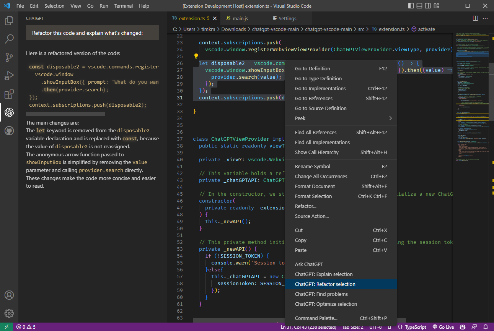
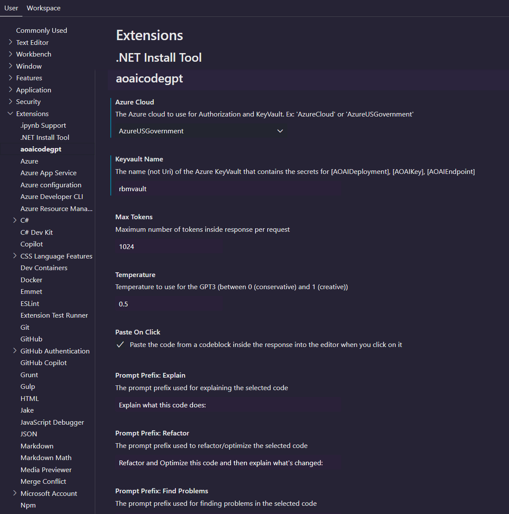
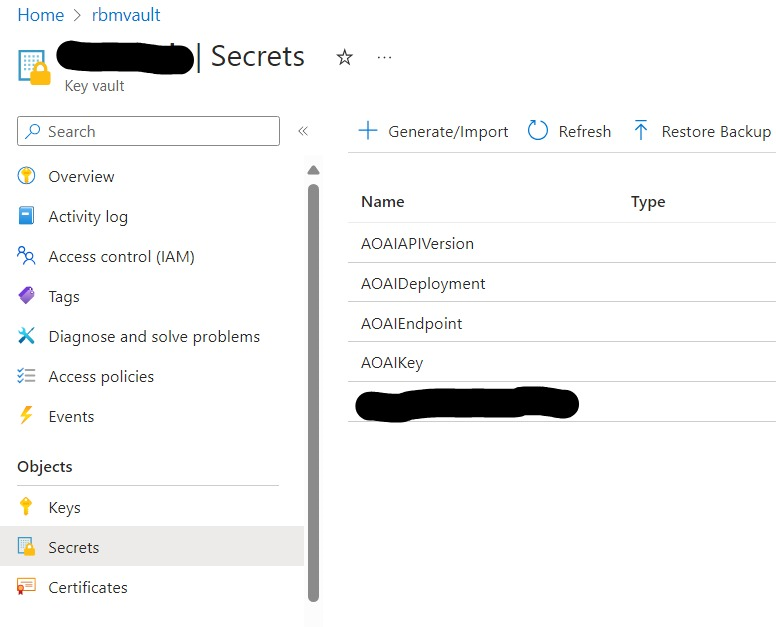
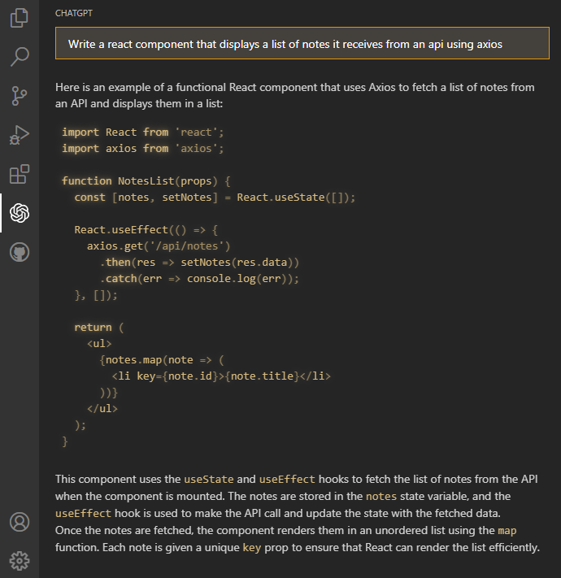
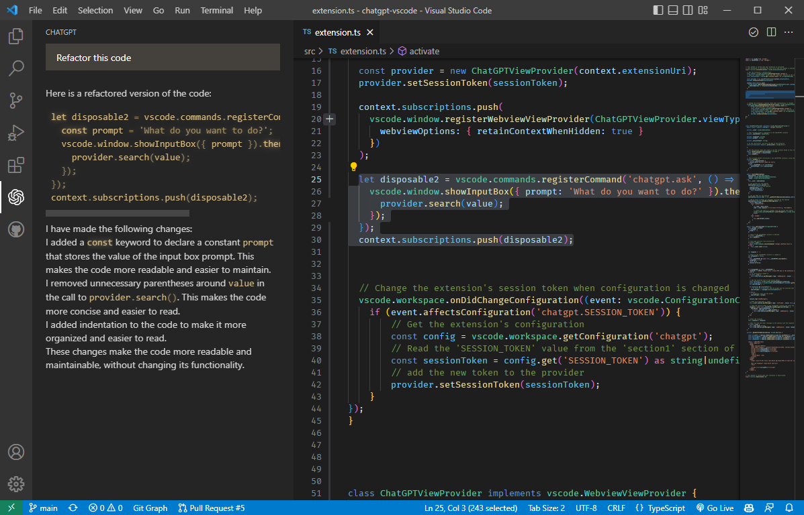

# ecma-codebuddy: GPT3 and ChatGPT extension for VSCode for use within the US Army 

This project is a large rewrite of  <a href="https://github.com/ThePush/azurecodegpt">AzureCodeGPT</a> that uses Azure OpenAI hosted in Azure commercial or GovCloud *without* requiring an API key. The extension provides an AI coding assistant to developers in Gov/DoD that cannot use GitHub Copilot due to security/compliance restraints. 

The only required settings for this version are:
- `Azure cloud`: 'AzureCloud' for commercial, 'AzureUSGovernment' for GovCloud. The extension will use the appropriate [Azure Graph Endpoint](https://learn.microsoft.com/en-us/graph/deployments#microsoft-graph-and-graph-explorer-service-root-endpoints) to load a credential for the current user.
- `Keyvault Name`: The name of the [KeyVault](https://azure.microsoft.com/en-us/products/key-vault/) where the necessary configuration secrets will be stored.

Required KeyVault Configuration:
- `AOAIDeployment`: the name of the AOAI deployment. Ex. "gpt-35-turbo" or "gpt-4o"	
- `AOAIEndpoint`: the Uri of AOAI instance. Ex. "https://{yourname}.openai.azure.us/" or "https://{yourname}.openai.azure.com/"
- `AOAIKey` : the API Key from the AOAI instance
- `AOAIAPIVersion`: the version of the OpenAI API used to interact with the AOAI endpoint. Ex. "2024-04-01-preview"

**The current user must be able to login to Azure via [az cli](https://learn.microsoft.com/en-us/cli/azure/install-azure-cli), and must have reader access to the configured Key Vault**

---

### Imperatives:
You must ensure that you are using the correct cloud for IL-classified work. The extension will not do this for you.  The extension does provide simple logic to ensure that if you set `AzureUSGovernment` in the `AzureCloud` setting, it will only try to connect to a KeyVault hosted in AzureGov, and also sanity-check the AOAIEndpoint value to ensure it is a GovCloud endpoint.

This Visual Studio Code extension uses the [official v4 OpenAI Client Library](https://www.npmjs.com/package/openai) and the [Azure Open API migration guide](https://learn.microsoft.com/en-us/azure/ai-services/openai/how-to/migration-javascript?tabs=javascript-new) to generate code or natural language responses to your questions from any GPT model hosted by Azure OpenAI.

`npm audit` shows 0 vulnerabilies as of 2024-10-01

Supercharge your coding with AI-powered assistance! Automatically write new code from scratch, ask questions, get explanations, refactor code, find bugs and more 🚀✨ 

---

# 📢 v2.0 Release
- **[Github Repository](https://github.com/rbmathis/ecma-codebuddy)**
-   Based on the original <a href="https://marketplace.visualstudio.com/items?itemName=jeremysemel.azurecodegpt">CodeGPT</a> v1.1.2
-   Updated to latest version of openai, added functionality to create unit tests

---

## Features
- 💡 **Ask general questions** or use code snippets from the editor to query GPT3 via an input box in the sidebar
- 🖱️ Right click on a code selection and run one of the context menu **shortcuts**
	- automatically write documentation for your code
	- explain the selected code
	- refactor or optimize it
	- find problems with it
- 💻 View GPT's responses in a panel next to the editor
- 📝 **Insert code snippets** from the AI's response into the active editor by clicking on them

---

## Installation

1. clone this repo
2. Install vsce: `npm install vsce`
3. From the cloned directory run: `vsce package`
4. Drag/drop the .vsix file from the folder into your VSCode Extensions window

After completing these steps, the extension should be ready to use after a restart.

---

## KeyVault Configuration
1. This extension expects the current user to login to Azure via `az login`. The extension then uses the cliCredential to connect to Key Vault. **The user must have at least 'Secrets User' access to Key Vault in order for the extension to load the necessary configuration values.
2. The KeyVault must contain secrets for the following settings:
 - AOAIAPIVersion : required by the latest openai SDK.
 - AOAIDeployment: the name of the deployment within Azure Open AI
 - AOAIEndpoint: the Uri to the endpoint hosted by Azure Open AI
 - AOAIKey: a valid key to use to connect to the Azure Open AI endpoint

---

## Using the Extension

The extension uses an AzureCliCredential to connect to an Azure Key Vault to load the secrets for Azure Open AI.  
First, login to the Azure CLI by running `az login`. For government users, first run `az cloud set --name AzureUSGovernment`.  Once logged-in, the extension will use this credential to check for access to the KeyVault.  The current user must have an IAM role that allows the reading of secrets. "Key Vault Secrets User" is sufficient.  

To use the extension, open a text editor in Visual Studio Code and open the aoaigpt panel by clicking on the aoaigpt icon in the sidebar. This will open a panel with an input field where you can enter your prompt or question. By clicking enter, it will be sent to AOAI. Its response will be displayed below the input field in the sidebar (note that it may take some time for it to be calculated).

You can also select a code snippet in the editor and then enter a prompt in the side panel, or right-click and select "Ask aoaigpt". The **selected code will be automatically appended** to your query when it is sent to the AI. This can be useful for generating code snippets or getting explanations for specific pieces of code.

To **insert a code snippet** from the AI's response into the editor, simply click on the code block in the panel. The code will be automatically inserted at the cursor position in the active editor. This functionality is controlled by the setting `pasteOnClick` setting.  If true, clicks within the results window will be pasted into the open document.

You can select some code in the editor, right click on it and choose one of the following **shortcuts** from the context menu:
#### Commands:
- `Ask ecma-codebuddy`: will provide a prompt for you to enter any prompt
- `ecma-codebuddy: Explain selection`: will explain what the selected code does
- `ecma-codebuddy: Refactor and Optimize selection`: will try to refactor and optimize the selected code
- `ecma-codebuddy: Find problems`: looks for problems/errors in the selected code, fixes and explains them
- `ecma-codebuddy: Write tests` : tries to create unit tests for the selected code

`Ask ecma-codebuddy` is also available when nothing is selected. For the other four commands, you can **customize the exact prompt** that will be sent to the AI by editing the extension settings in VSCode Preferences.

