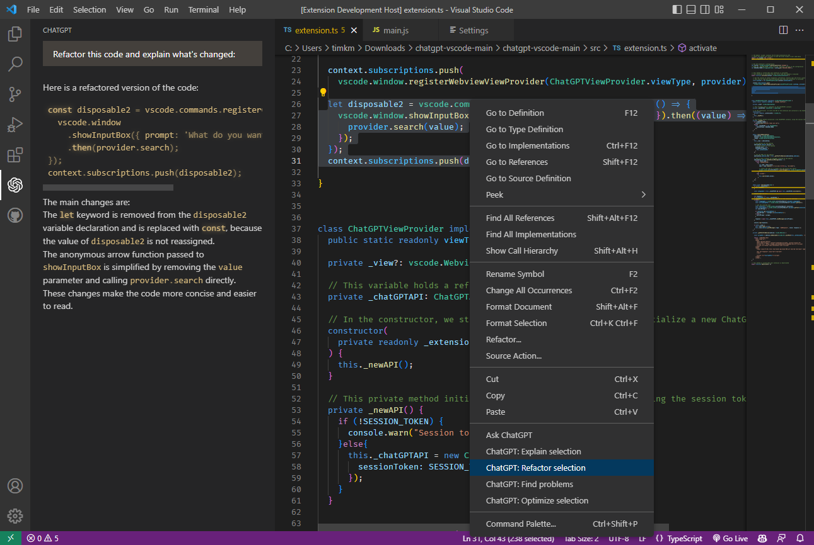
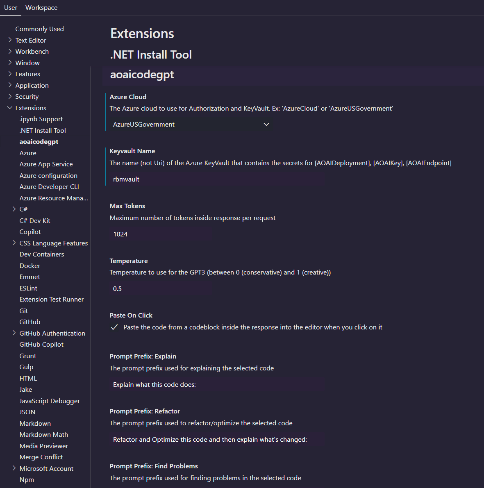
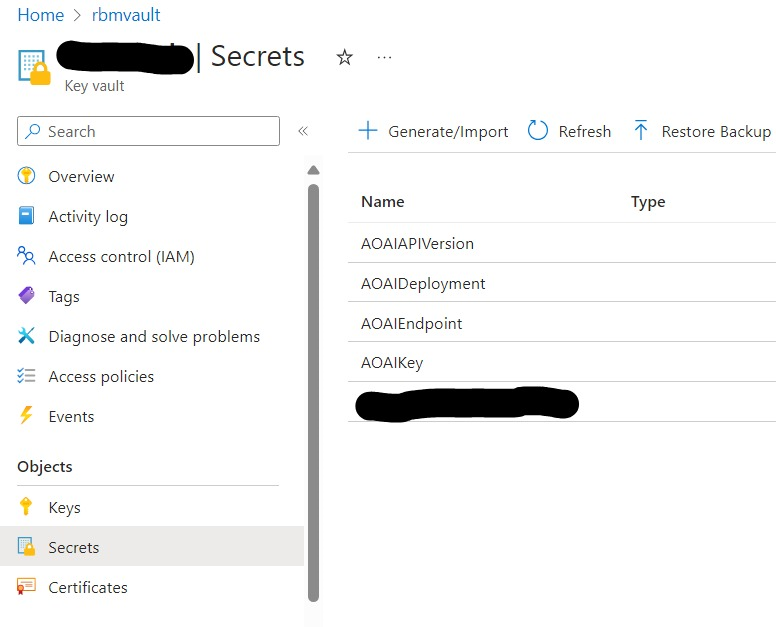
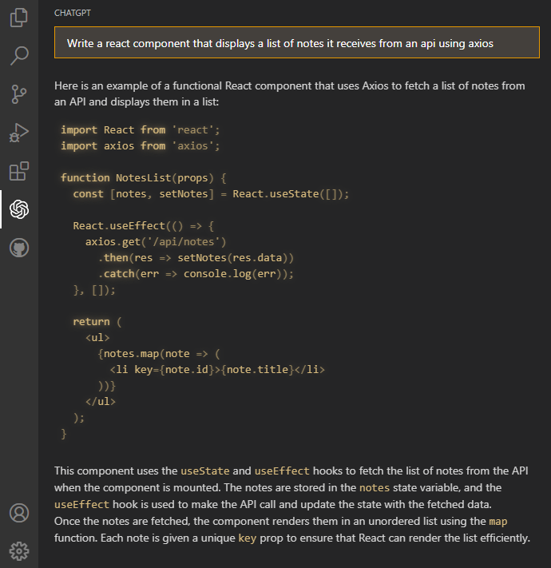
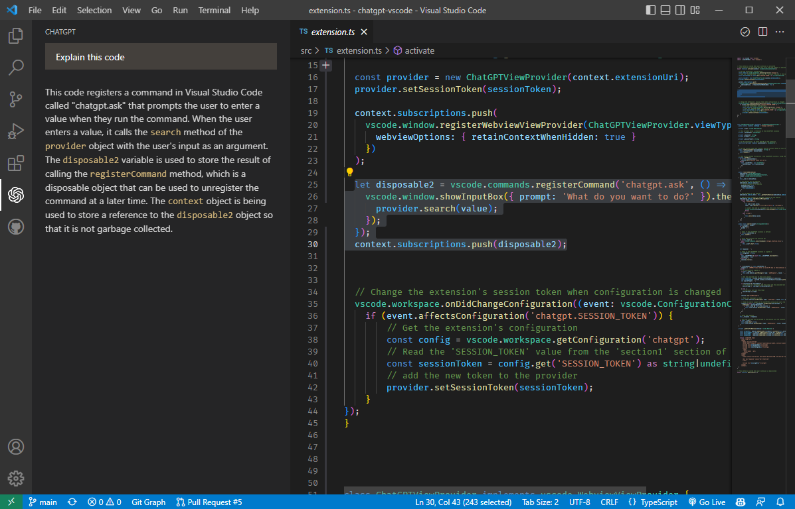
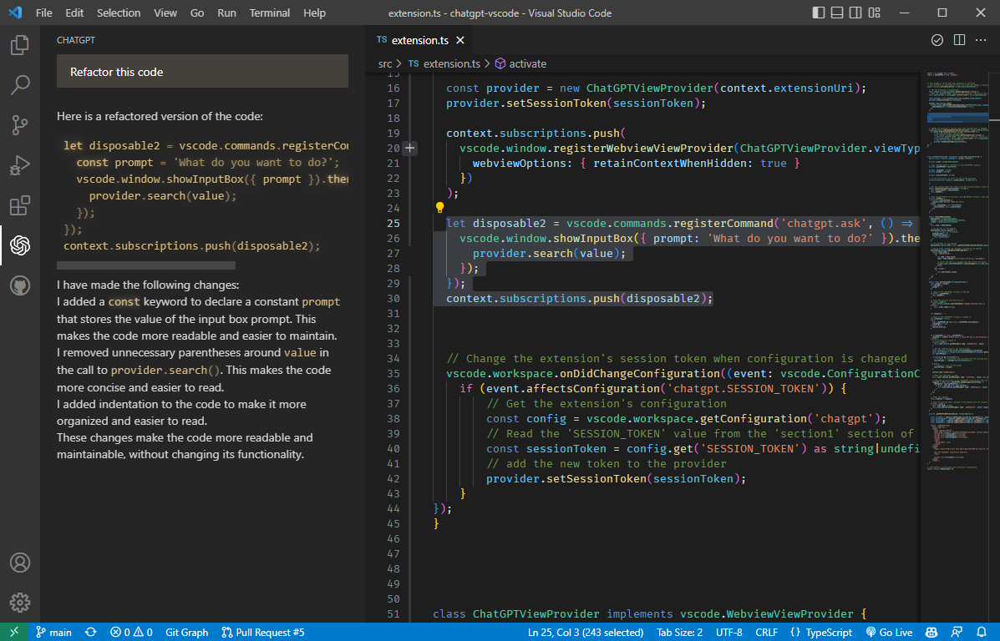

# ecma-codebuddy: Azure OpenAI (commercial & GovCloud) VS Code assistant

=======

This project is a modern rewrite of <a href="https://github.com/ThePush/azurecodegpt">AzureCodeGPT</a>. It uses the official <strong>OpenAI v4 SDK</strong> against <strong>Azure OpenAI</strong> (commercial or <strong>AzureUSGovernment</strong>) via <strong>AzureCliCredential</strong>—no static API keys in VS Code. It targets teams that cannot use GitHub Copilot but still need AI coding assistance.

**Prereqs**

- `az login` (Gov: `az cloud set --name AzureUSGovernment`)
- Access to the configured Azure Key Vault (at least <em>Secrets User</em>)

**Required Key Vault secrets**

- `AOAIDeployment` – e.g., `gpt-35-turbo`, `gpt-4o`
- `AOAIEndpoint` – e.g., `https://{name}.openai.azure.us/` or `https://{name}.openai.azure.com/`
- `AOAIKey` – AOAI key
- `AOAIAPIVersion` – e.g., `2024-04-01-preview`

**Required settings in VS Code**

- `ecma-codebuddy.azureCloud` – `AzureCloud` (default) or `AzureUSGovernment`
- `ecma-codebuddy.keyvaultName` – Key Vault name (not URI)

The extension chooses the correct Graph / Key Vault endpoints based on `azureCloud` and validates GovCloud endpoints when `AzureUSGovernment` is selected.

---

### Imperatives

- Pick the correct cloud for IL workloads; we sanity-check Gov endpoints but you own the classification.
- We use the <a href="https://www.npmjs.com/package/openai">official OpenAI v4 client</a> and the <a href="https://learn.microsoft.com/en-us/azure/ai-services/openai/how-to/migration-javascript?tabs=javascript-new">Azure OpenAI migration guide</a>.

`npm audit` shows 0 vulnerabilities as of 2024-10-01

Supercharge your coding with AI-powered assistance! Automatically write new code from scratch, ask questions, get explanations, refactor code, find bugs and more 🚀✨

---

# 📢 v2.0 Release

- **[Github Repository](https://github.com/rbmathis/ecma-codebuddy)**
- Based on <a href="https://marketplace.visualstudio.com/items?itemName=jeremysemel.azurecodegpt">CodeGPT</a> v1.1.2
- Updated to the latest `openai` v4 client; added "Write tests" command
  

---

## Features

- 💡 **Ask general questions** or use editor selections to query Azure OpenAI via the sidebar
- 🖱️ Right click on a code selection and run one of the context menu **shortcuts**
  - automatically write documentation for your code
  - explain the selected code
  - refactor or optimize it
  - find problems with it
- 💻 View GPT's responses in a panel next to the editor
- 📝 **Insert code snippets** from the AI's response into the active editor by clicking on them

---

## Installation

1. Clone this repo
2. Install deps: `npm install` (or `yarn install`)
3. Install vsce: `npm install -g vsce` (or `npx vsce`)
4. Package: `vsce package`
5. Drag/drop the `.vsix` into VS Code Extensions

After installation, reload VS Code.

---

## KeyVault Configuration

1. `az login` (Gov: `az cloud set --name AzureUSGovernment`)
2. Ensure the current user has Key Vault **Secrets User** (or higher)
3. Create secrets: `AOAIAPIVersion`, `AOAIDeployment`, `AOAIEndpoint`, `AOAIKey`

---

## Using the Extension

The extension uses `AzureCliCredential` to load AOAI secrets from Key Vault. Once logged in and configured:

1. Open the **ecma-codebuddy** panel (sidebar icon)
2. Enter a prompt; press Enter to send to Azure OpenAI
3. Responses appear in the panel; click code blocks to paste (if enabled)

You can also select code in the editor and either enter a prompt in the side panel or right-click and choose **Ask ecma-codebuddy**. The **selected code is automatically appended** (optionally wrapped in a code block).

To **insert a code snippet** from the AI's response into the editor, simply click on the code block in the panel. The code will be automatically inserted at the cursor position in the active editor. This functionality is controlled by the setting `pasteOnClick` setting. If true, clicks within the results window will be pasted into the open document.

You can select code and right-click for these **shortcuts**:

#### Commands

- `ecma-codebuddy.ask` — prompt input box
- `ecma-codebuddy.explain` — explain selection
- `ecma-codebuddy.refactor` — refactor & optimize
- `ecma-codebuddy.findProblems` — identify & fix issues
- `ecma-codebuddy.documentation` — write docs
- `ecma-codebuddy.writetests` — generate tests

`Ask ecma-codebuddy` works with or without a selection. All prompt prefixes are configurable in VS Code settings.

---

## Settings

| Setting                                  | Default      | Description                         |
| ---------------------------------------- | ------------ | ----------------------------------- |
| `ecma-codebuddy.azureCloud`              | `AzureCloud` | `AzureCloud` or `AzureUSGovernment` |
| `ecma-codebuddy.keyvaultName`            | `""`         | Key Vault name (no URI)             |
| `ecma-codebuddy.maxTokens`               | `1024`       | Max tokens per response             |
| `ecma-codebuddy.temperature`             | `0.5`        | Creativity vs. determinism          |
| `ecma-codebuddy.pasteOnClick`            | `true`       | Paste code blocks on click          |
| `ecma-codebuddy.selectedInsideCodeblock` | `true`       | Wrap selection in fenced code       |
| `ecma-codebuddy.promptPrefix.*`          | _(varies)_   | Customize prompts for each command  |

---

## Development

Scripts (npm/yarn):

- `watch` – `webpack --watch`
- `compile` – production webpack bundle
- `lint` – ESLint on `src`
- `compile-tests` / `watch-tests` – `tsc` into `out/`
- `test` – VS Code extension tests scaffold (`out/test/runTest.js`)

> Tests are scaffolded but not yet implemented; add tests and run `yarn test` before PRs.

VS Code tasks exist for `npm: watch` and `npm: watch-tests`.

---

## GovCloud safeguards

- When `AzureUSGovernment` is selected, the extension builds Gov Key Vault URIs and checks `AOAIEndpoint` ends with `.us`.
- Graph scopes switch to `graph.microsoft.us`.

---

## License

MIT
